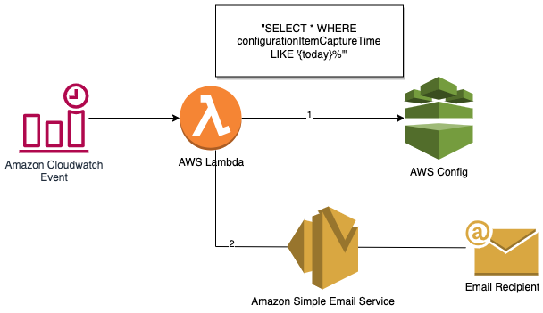

# AWS Config Daily Reporter
 
The Config Daily Reporter solution can be used in order to generate a daily CSV report.
The report will include new or changed resources, with a link to the AWS Config UI.
The reporter is triggered using a CloudWatch event, that will trigger a Lambda function. The Lambda will use SES to send an email.


### Prerequisites
Before getting started, make sure that you have a basic understating of the following:
* Amazon EventBridge rule that runs on a schedule
* Multi-Account Multi-Region Data Aggregation
* AWS Lambda Function
* Python and Boto3.
* CDK environments.  

You will also need to have a pre-configured Multi-Account AWS Config Aggregator and Amazon SES for sending email.


### Architecture
1. Amazon CloudWatch event - will trigger Lambda every day
2. AWS Lambda - will run Python3 code which includes an AWS Config Query and SendEmail using SES.
3. AWS Config - aggregator which will get a query from the Lambda function.
4. Amazon Simple Email Service - will be used to send an email with the CSV file.



### Getting Started


1. ```git clone https://github.com/aws-samples/config-daily-report```
2. ```cd config-daily-reporter/cdk```
3. ```cdk bootstrap```
4. ```cdk deploy --parameters aggregator=<aggregator name> \ --parameters RECIPIENT=<recipient email address> \ --parameters SENDER=<sender email address> \ --parameters HOUR=<time in UTC (hour)> \ --parameters MINUTE==< time in UTC (minute)> \ --parameters sesarn=<Your SES ARN>```  
    Replace the parameters as follows:
    * aggregator - Name of AWS Config Aggregator.
    * RECIPIENT - Email recipient that will get the csv report.
    * SENDER - Email sender as configured on SES.
    * HOUR - The hour (UTC) the Lambda will run.
    * MINUTE - The minute (UTC) the Lambda will run.
    * sesarn - your preconfigured AWS SES arn.
5. The deployment will generate a report.
6. Check your email inbox.


## Security
See [CONTRIBUTING](CONTRIBUTING.md#security-issue-notifications) for more information.

## License
This library is licensed under the MIT-0 License. See the LICENSE file.

